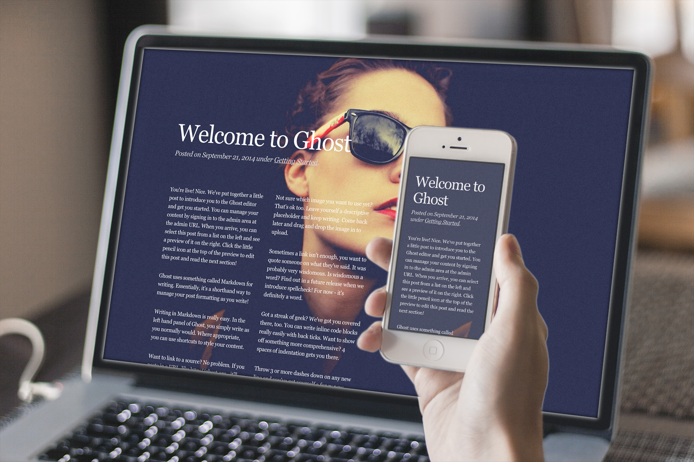

# Vignette

A minimalistic theme for [Ghost](https://ghost.org/) inspired by [Medium prototypes](https://dribbble.com/shots/1526147-Medium-Layouts).



## Installation

1. Download the theme from GitHub.
2. Upload the theme as described in the [Ghost Documentation](http://docs.ghost.org/usage/settings/).

Looking for more instructions? Sorry, it's just that easy.

## Featured images

While featured images are not part of Ghost (yet), there are ways to implement them with some hacky Javascript. If you want to enable featured images, simply open `post.hbs` (and/or `page.hbs`) and remove the exclamation mark in the comments block, so `{{!> featured}}` becomes `{{> featured}}`. You can also remove the background-cover code from each file to prevent flashing content:

```
{{#if @blog.cover}}style="background-image: url({{@blog.cover}})"{{/if}}
```

This will remove the first image in your article and use it as the cover photo, so make sure you put a featured image at the top of your article.

## Forking and derivatives

I don't really mind what you do with this project, as long as your blog looks awesome. I'd appreciate if you left the `<meta name="designer">` as Hayden Bleasel but I won't hold it against you if you change it. I think it'd be good if you make some reference back to me so people can find the source project, but other than that just have fun. Also, if you're going to make style edits I recommend creating a new stylesheet and linking that up so you can still fetch the latest updates from here without losing all your changes.
